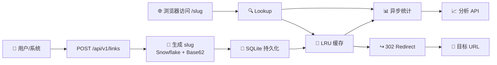

# 01 | ShortLink：从零构建一个高性能短链接服务

> 「用 Go 构建短链接服务」专栏第 1 篇。开篇介绍 ShortLink 项目的设计初衷、核心特性、技术选型和项目架构。

---

## 为什么需要 ShortLink

在构建 quillgo 和 nexusgate 两个项目时，发现缺少一套基础设施服务来支撑日常的 DevOps 需求。短链接是最基础且最常用的工具——无论是分享构建日志、发布部署通知、还是嵌入 CLI 工具的输出，都需要一个可靠、自托管的短链接服务。

与其依赖第三方服务（TinyURL、Bit.ly）带来的隐私风险和服务不可用问题，不如自建一个。ShortLink 就是这个拼图的第一块。

## 项目定位与目标用户

| 维度 | 定位 |
|------|------|
| **场景** | DevOps 基础设施，嵌入 CI/CD 管道和 CLI 工具 |
| **用户** | 开发者、运维工程师、quillgo/nexusgate 内部服务 |
| **规模** | 万级短链，单机部署足以胜任 |
| **原则** | 零外部框架依赖、纯 Go 实现、HTML 唯一 UI |

## 核心特性



- **极速短码生成**：Snowflake 分布式 ID + Base62 编码，6 位字符即可覆盖 560 亿个短链
- **分片 LRU 缓存**：256 分片自研泛型缓存，零锁竞争，并发读写友好
- **异步点击统计**：缓冲 channel + worker pool，统计写入不阻塞重定向
- **纯 Go SQLite**：modernc.org/sqlite，零 CGO 依赖，交叉编译无忧
- **优雅关闭**：全面的信号处理，HTTP Server + 统计引擎有序退出
- **配置热加载**：SIGHUP 信号触发 `atomic.Value` 运行时配置更新
- **密码保护**：短链接密码验证页 + Cookie 会话机制
- **QR Code 生成**：创建短链时可选生成 base64 PNG 二维码
- **Prometheus 监控**：HTTP 请求计数/延迟/状态码 + 队列积压指标
- **pprof 调试**：独立端口暴露 Go 性能分析端点
- **Bloom Filter**：自定义 slug 碰撞快速排除，减少 DB 查询

## 技术选型

| 需求 | 选择 | 备选 | 选择理由 |
|------|------|------|----------|
| ID 生成 | Snowflake + Base62 | UUID, NanoID | 有序、短小、分布式友好 |
| 缓存 | 自研泛型分片 LRU | go-cache, bigcache | 零外部依赖，泛型类型安全 |
| 数据库 | SQLite (WAL) | MySQL, PostgreSQL | 单机场景最优，零运维 |
| SQLite 驱动 | modernc.org/sqlite | mattn/go-sqlite3 | 纯 Go，无 CGO，交叉编译 |
| 配置 | YAML + atomic.Value | Viper, envconfig | 极简，足够用 |
| HTTP 路由 | net/http 标准库 | Gin, Echo | 零框架依赖原则 |
| 统计写入 | Channel + Worker Pool | 同步写入，消息队列 | 简单可靠，不增加外部依赖 |
| 监控指标 | prometheus/client_golang | expvar, OpenTelemetry | 行业标准，Grafana 生态 |
| QR Code | go-qrcode | rsc.io/qr | 纯 Go，API 简洁，输出质量高 |
| 碰撞检测 | 自研 Bloom Filter | 纯 DB 查询 | 概率去重，万级场景命中率高 |

## 项目结构一览

```
shortlink/
├── cmd/shortlink/main.go          # 入口：组装依赖、启动/优雅关闭
├── internal/
│   ├── model/model.go             # 共享领域模型 + 哨兵错误
│   ├── slug/                      # Snowflake ID + Base62 编解码
│   │   ├── snowflake.go
│   │   └── generator.go
│   ├── bloom/bloom.go             # Bloom Filter 防 slug 碰撞
│   ├── cache/sharded_lru.go       # 泛型分片 LRU 缓存（256 分片）
│   ├── store/store.go             # SQLite 持久化 + 自动迁移
│   ├── core/                      # 核心业务逻辑
│   │   ├── model.go               # Service 接口定义
│   │   └── service.go             # CRUD + 密码验证 + Bloom 集成
│   ├── analytics/analytics.go     # 异步点击统计引擎
│   ├── metrics/metrics.go         # Prometheus 指标定义
│   ├── config/config.go           # YAML 配置加载 + 热更新
│   └── api/router.go              # HTTP 路由 + Handler + 中间件 + QR Code
├── .github/workflows/ci.yml       # CI/CD Pipeline (lint + test + build)
├── config.example.yaml
├── Dockerfile                     # 多阶段构建 (Alpine, 非 root)
├── Makefile                       # build / test / lint / docker / release
├── ROADMAP.md                     # 项目路线图
└── .golangci.yml                  # Lint 配置
```

## 快速开始

```bash
# 1. 编译
go build -o shortlink ./cmd/shortlink/

# 2. 准备配置
cp config.example.yaml config.yaml
# 编辑 config.yaml，修改 admin_token 和 public_url

# 3. 启动
./shortlink -config config.yaml

# 4. 创建短链接
curl -X POST http://localhost:8080/api/v1/links \
  -H "Authorization: Bearer changeme" \
  -H "Content-Type: application/json" \
  -d '{"long_url": "https://example.com/very/long/path"}'

# 5. 访问短链接
curl -v http://localhost:8080/QIqddS
# → HTTP/1.1 302 Found
# → Location: https://example.com/very/long/path
```

或者使用 Docker：

```bash
docker build -t shortlink .
docker run -d -p 8080:8080 -v ./data:/data shortlink
```

## 设计哲学

1. **零外部框架** — 核心逻辑只用标准库 + 两个不可替代的依赖（SQLite 驱动 + YAML 解析）
2. **接口驱动** — 核心类型 `Service` 是接口，`Store` 接口由包定义，方便测试 mock
3. **从内向外** — 开发顺序：model → slug → cache → store → core → analytics → api → main
4. **表驱动测试** — 所有测试使用 Go 标准模式，含 `-race` 竞态检测

## 专栏导航

| 序号 | 标题 | 核心内容 |
|------|------|----------|
| 01 | 概述与设计初衷 | 项目定位、核心特性、技术选型（本文） |
| 02 | Snowflake + Base62 短码生成 | ID 生成算法、Base62 编码、Bloom Filter 防碰撞 |
| 03 | 泛型分片 LRU 缓存 | 256 分片设计、侵入式链表、Hash 策略 |
| 04 | SQLite 持久化与存储设计 | WAL 模式、表结构、迁移策略、并发安全 |
| 05 | 核心服务层：CRUD 与缓存联动 | 创建流程、密码验证、Lookup 优先级、TTL |
| 06 | 异步统计引擎 | Channel 缓冲、Worker Pool、优雅关闭 |
| 07 | HTTP API 设计与中间件链 | RESTful 设计、CORS/Auth/Metrics、重定向、QR Code |
| 08 | 可观测性：Metrics + pprof + 日志 | Prometheus 指标、pprof 调试、结构化日志 |
| 09 | 构建、测试与部署 | Makefile、Docker、CI/CD、测试策略 |
| 10 | 专栏总结与未来方向 | 架构回顾、性能数据汇总、扩展方向 |

---

> 下一篇：[02 \| Snowflake + Base62 短码生成](shortlink-02-snowflake-and-base62)