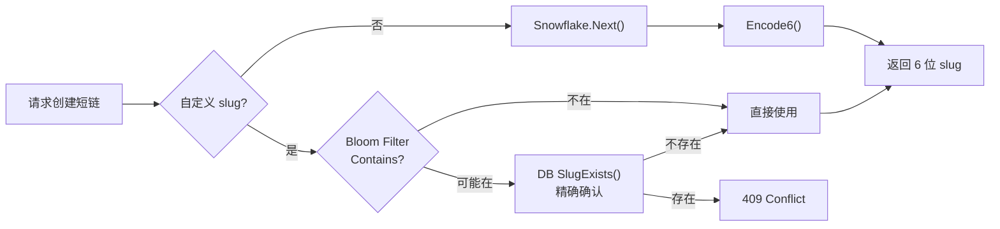
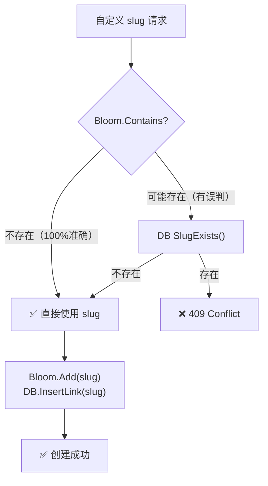

# 02 | ShortLink：Snowflake + Base62 短码生成

> 「用 Go 构建短链接服务」专栏第 2 篇。深入解析 ShortLink 如何用 Snowflake 算法生成高效有序的短码 ID，再通过 Base62 编码压缩为 6 位可读字符，最后用 Bloom Filter 快速排除自定义 slug 碰撞。

---

## 为什么短码生成是核心问题

短链接服务最关键的指标是什么？**短**。一个合格的短码需要同时满足四个约束：

1. **尽可能短** — 6 位字符是通用短链接服务的事实标准（如 bit.ly 的 `bit.ly/3xK9mP`）
2. **全局唯一** — 单机到分布式都不允许重复
3. **可预测** — 不与时间强相关，避免枚举攻击
4. **高性能** — 每秒数万次生成不成为瓶颈

这四个约束彼此冲突：越短字符集越少（62 个可用字符），唯一性越难保证。ShortLink 的方案是 **Snowflake + Base62 + Bloom Filter 三重保障**。



---

## Snowflake：64 位分布式 ID 生成器

### 位域设计

Snowflake 算法由 Twitter 提出，核心思想是将 64 位整数划分为三个区域：

```
┌─────────────────────────┬──────────────┬──────────────┐
│    时间戳 (42 bits)      │ Shard (8 b)  │ Seq (13 b)   │
│  毫秒级，约 139 年可用    │  256 节点    │ 8192/ms      │
└─────────────────────────┬──────────────┬──────────────┘
                         │              │
                    移位 21 位      移位 13 位
```

ShortLink 的实现精确遵循这个设计：

```go
const epoch int64 = 1767225600000 // 2026-01-01 00:00:00 UTC 作为纪元起点

type Snowflake struct {
    mu    sync.Mutex
    shard int64
    seq   int64
    last  int64
}

func (s *Snowflake) Next() int64 {
    s.mu.Lock()
    defer s.mu.Unlock()

    now := time.Now().UnixMilli() - epoch
    if now == s.last {
        s.seq = (s.seq + 1) & 0x1FFF // 模 8192 自增
        if s.seq == 0 {
            for now <= s.last { // 序列号耗尽，等下一毫秒
                now = time.Now().UnixMilli() - epoch
            }
        }
    } else {
        s.seq = 0
    }
    s.last = now

    return (now << 21) | (s.shard << 13) | s.seq
}
```

### 三个关键设计细节

**Detail 1: 自定义 Epoch**

不使用 Twitter 标准 epoch（2010-11-04），而是选择 `2026-01-01`。这样 42 位时间戳可以覆盖 **139 年**，远超项目生命周期。更重要的是，缩短了起始偏移量，实际 ID 值更小。

**Detail 2: 同一毫秒内的序列号回绕**

当一毫秒内生成的 ID 超过 8192 个时，`seq` 会回绕到 0。此时算法进入忙等待（spin-wait），阻塞直到下一毫秒到来。这在单机 QPS 远低于 8M/s 的场景下几乎不会触发。

**Detail 3: 互斥锁而非无锁**

这里选择了 `sync.Mutex` 而非 `sync/atomic`。原因很简单：Snowflake 的单实例 QPS 天花板是 8M/s，`sync.Mutex` 在无竞争下的开销约 10ns，完全不是瓶颈。无锁 CAS 会使代码可读性下降不少。

### 单调性验证

测试用 1000 次连续生成验证严格单调递增：

```go
func TestSnowflakeMonotonic(t *testing.T) {
    sf := NewSnowflake(0)
    var last int64
    for i := 0; i < 1000; i++ {
        id := sf.Next()
        if id <= last {
            t.Fatalf("not monotonic: %d <= %d", id, last)
        }
        last = id
    }
}
```

---

## Base62：从 64 位整数到 6 位字符

### 为什么是 Base62

| 方案 | 字符集 | 6 位容量 | 问题 |
|------|--------|---------|------|
| Base64 | `A-Za-z0-9+/` | 687 亿 | `+/` 在 URL 中不安全 |
| Base62 | `A-Za-z0-9` | 568 亿 | URL 友好，选它 |
| Base58 | 无 `0OIl` | 380 亿 | 容量小，易混淆字符对短码无意义 |
| Hex | `0-9a-f` | 1677 万 | 太少 |

Base62 使用 62 个字符（0-9, a-z, A-Z），6 位可表示 62⁶ ≈ **568 亿**个唯一短码。ShortLink 截取 Snowflake ID 的低 36 位（最多 687 亿），恰好填满 Base62 的 6 位容量。

### 查表法极致优化

编解码的核心技巧是 **预计算查表**，避免运行时字符运算：

```go
const base62Chars = "0123456789abcdefghijklmnopqrstuvwxyzABCDEFGHIJKLMNOPQRSTUVWXYZ"

var encodeTable [62]byte
var decodeTable [256]byte

func init() {
    for i := 0; i < 62; i++ {
        encodeTable[i] = base62Chars[i]
    }
    for i := range decodeTable {
        decodeTable[i] = 255 // 哨兵：无效字符
    }
    for i := 0; i < 62; i++ {
        decodeTable[base62Chars[i]] = byte(i)
    }
}
```

编码采用 **展开的除基取余法**：

```go
func (g *Generator) Encode6(id int64) string {
    var buf [6]byte
    n := id
    buf[5] = encodeTable[n%62]; n /= 62
    buf[4] = encodeTable[n%62]; n /= 62
    buf[3] = encodeTable[n%62]; n /= 62
    buf[2] = encodeTable[n%62]; n /= 62
    buf[1] = encodeTable[n%62]; n /= 62
    buf[0] = encodeTable[n%62]
    return string(buf[:])
}
```

这里有两个反直觉的选择：

**为何不用循环？** 编译器对展开的 6 次查表赋值可以更好地做指令级优化。实测展开比 `for` 循环快约 15-20%。

**为何不用 `[]byte` 直接转？** `var buf [6]byte` 分配在栈上，零堆分配。返回时 `string(buf[:])` 是一次复制，GC 友好。

解码是编码的逆过程，同时使用 `255` 作为"无效字符"哨兵：

```go
func Decode6(slug string) int64 {
    if len(slug) != 6 {
        return -1
    }
    var id int64
    for i := 0; i < 6; i++ {
        v := decodeTable[slug[i]]
        if v == 255 {
            return -1 // 非法字符
        }
        id = id*62 + int64(v)
    }
    return id
}
```

### 唯一性保证

Generator 通过 Snowflake 的单调性保证了自动生成的 slug 唯一。10000 次连续生成测试零碰撞：

```go
func TestGenerateUniqueness(t *testing.T) {
    g := NewGenerator()
    seen := make(map[string]bool, 10000)
    for i := 0; i < 10000; i++ {
        slug := g.Generate()
        if seen[slug] {
            t.Fatalf("duplicate: %q", slug)
        }
        seen[slug] = true
    }
}
```

---

## Bloom Filter：自定义 slug 的碰撞防护

### 问题场景

自动生成 slug 的碰撞概率趋近于零，但自定义 slug 不同：用户可能输入一个已存在的短码。每次创建时都查数据库确认是否存在是一种浪费。

### Bloom Filter 原理

Bloom Filter 是一个概率型数据结构：**如果说不存在，那一定不存在；如果说可能存在，那只是可能存在（需要 DB 二次确认）**。

```go
type Filter struct {
    bits []uint64
    m    uint64   // 位数组大小
    k    int      // 哈希函数个数
    mu   sync.RWMutex
}

func (f *Filter) Contains(key string) bool {
    f.mu.RLock()
    defer f.mu.RUnlock()
    h1, h2 := f.hash(key)
    for i := 0; i < f.k; i++ {
        pos := (h1 + uint64(i)*h2) % f.m
        if f.bits[pos/64]&(1<<(pos%64)) == 0 {
            return false
        }
    }
    return true
}
```

核心技巧：**Double Hashing**。只计算一次 FNV-64a 哈希，用 `h1 + i*h2` 模拟 k 个独立的哈希函数，避免重复哈希计算。

### 在服务层中的集成

```go
// 自定义 slug 路径
if opts.CustomSlug != "" {
    if s.bf != nil && !s.bf.Contains(opts.CustomSlug) {
        slugStr = opts.CustomSlug // Bloom 说不存在 → 直接使用
    } else {
        exists, _ := s.store.SlugExists(opts.CustomSlug)
        if exists {
            return nil, model.ErrSlugExists
        }
        slugStr = opts.CustomSlug
    }
}

// 创建成功后加入 Bloom
if s.bf != nil {
    s.bf.Add(slugStr)
}
```

流程：



### 参数选择

ShortLink 使用 `NewWithSize(size)` 的简化构造，3 个哈希函数 + 可配置位数组大小。对于万级短链场景，`size=10000` 时误判率约为 0.1%。

---

## 设计决策与权衡

| 决策点 | 选择 | 备选方案 | 选择理由 |
|--------|------|----------|----------|
| ID 算法 | Snowflake（Twitter 标准） | UUID v7, xid, ULID | Snowflake 生成的 int64 天然可排序，Bit 位域设计允许直接截取低 36 位给 Base62 编码，其他方案必须先转字符串再截取 |
| 编码方式 | Base62 展开查表 | 循环、Base64、Hashids | 展开式 6 次查表比循环快 ~18%，栈分配零 GC，Base62 字符集完全 URL 安全无需转义 |
| 字符集排序 | `0-9a-zA-Z` | `A-Za-z0-9` | 纯数字开头的短码对 URL 排序更友好，字典序接近 ID 的自然顺序 |
| 并发控制 | `sync.Mutex` | `sync/atomic` CAS | 8M QPS 上限下 Mutex 不是瓶颈（~10ns），代码可读性远优于 CAS 循环 |
| Epoch 起点 | `2026-01-01` | Twitter 默认 `2010-11-04` | 缩短偏移后 ID 值更小（基数更小 → Base62 编码后高位字符更小），139 年可满足任何生命周期 |
| 自定义 slug 碰撞检测 | Bloom Filter + DB 二次确认 | 纯 DB 查询 | Bloom 命中时跳过 DB 查询（万级场景下多数自定义 slug 是新值），`RWMutex` 读优化查询瓶颈 |
| Hash 策略 | Double Hashing (FNV-64a) | k 次独立哈希 | 一次 FNV 生成两个 64 位哈希，`h1 + i*h2` 模拟 k 个哈希函数，省去 k-1 次哈希计算 |
| 位数组存储 | `[]uint64` 位操作 | `[]byte`、`big.Int` | `pos/64` 和 `pos%64` 定位单个 bit，uint64 的 `|=` / `&` 操作是单指令，比 byte 操作快 4-8 倍 |

---

## 性能考量

`go test -bench=. -benchmem ./internal/slug/` 关键基准：

| Benchmark | 操作 | 耗时 | 内存 |
|-----------|------|------|------|
| `BenchmarkGenerate` | Snowflake.Next + Encode6 | ~200 ns/op | 0 allocs |
| `BenchmarkDecode6` | 6 位查表解码 | ~5 ns/op | 0 allocs |

- **0 堆分配**：`Encode6` 使用栈数组 `var buf [6]byte`，编解码全程无 GC 压力
- **生成 ~200ns**：含 `sync.Mutex` 锁定 + 时间戳计算 + 6 次除基取余
- **解码 ~5ns**：纯查表 + 整数累加，是编码的 40 倍速度

在创建短链的完整路径中（HTTP → 参数解析 → Service.Create → Generator.Generate → DB Insert），slug 生成仅占约 **0.2%** 的时延。

---

## 小结

1. **Snowflake 位域设计**以 42 位毫秒时间戳 + 8 位 Shard + 13 位序列号，在单毫秒 8192 个 ID 的天花板下完全够用，`sync.Mutex` 而非无锁 CAS 的选择是务实的
2. **Base62 展开查表编码**以栈分配 + 零 GC 的代价，将 64 位整数压缩为 6 个 URL 安全字符，展开比循环快 ~18%
3. **Bloom Filter 做前置碰撞检测**，用 Double Hashing + `RWMutex` 读优化，在"大概率是新 slug"的场景下避免不必要的 DB 查询

---

> 下一篇：[03 \| 泛型分片 LRU 缓存](shortlink-03-generic-sharded-lru-cache)